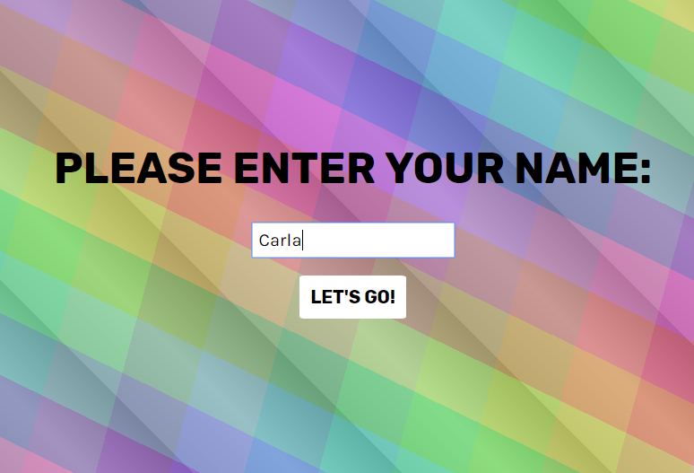
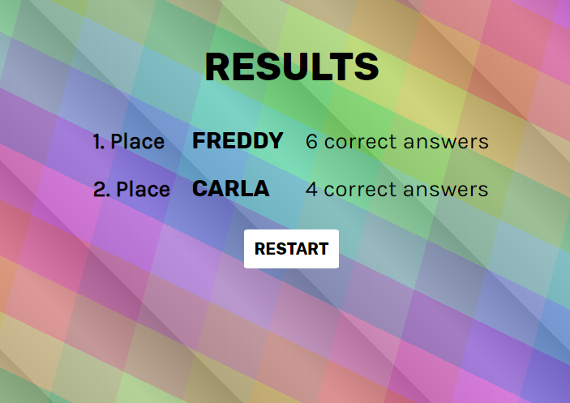

# quiz

[Live Version on heroku](cg-petition.herokuapp.com) 

Real-time online multiplayer quiz game using Socket.IO.

### Features include

-   multiple players can play against each other
-   jumps to the next question simultaneously after all users answered a question
-   indicates if answer was correct
-   shows correct answer if answer was incorrect
-   end screen ranking players by number of correct answers

**Stack:** React-Redux, Socket.IO, Redis, Node.js with Express.js, PostgreSQL

### Start Screen

### In-game Screen

### End Screen

